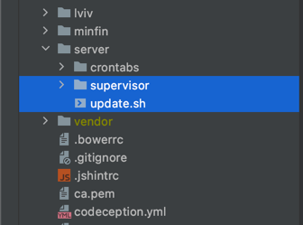

Automatic Supervisor configuration update
=============================================
[[UA Ukrainian](./examples/README.ua.md)] [[RU Russian](./examples/README.ru.md)]

You can use this structure to transfer Supervisor configuration files directly to your project and automatically synchronize them during the deployment.



To synchronize Supervisor configuration files, go to the directory where the update.sh file is located and do:
````shell
./update.sh
````

You can create new configuration files for Supervisor simply by adding them to the supervisor directory.

Once launched, all files will be synchronized with the supervisor directory (all files not in this directory will be deleted).

[Exchange rates in Ukraine](https://rate.in.ua) and [Exchange rates in Poland](https://minfin.pl)