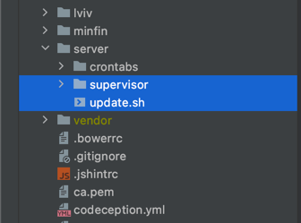

Автоматическое обновление конфигурации Supervisor
=============================================
[[UA Ukrainian](README.ua.md)] [[EN English](../README.md)]

Вы можете использовать данную структуру, чтобы перенести конфигурационные файлы Supervisor непосредственно в ваш проект и автоматически синхронизировать их во время деплоя.



Для синхронизации файлов конфигурации Supervisor перейдите в каталог, где находится файл update.sh и выполните: 
````shell
./update.sh
````

Вы можете создавать новые конфигурационные файлы для Supervisor просто добавив их в директорию supervisor.

После запуска все файлы будут синхронизированы с директорией supervisor (все файлы которых нет в данной директории будут удалены).